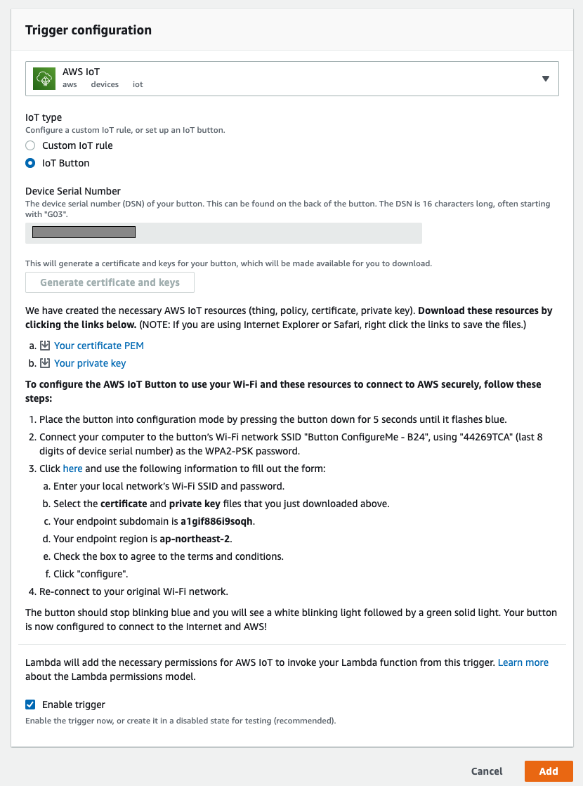
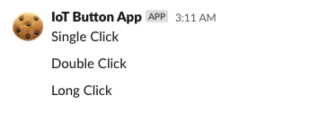

# 놀고 있는 AWS IOT Button 을 활용하기
집에서 방치되어있는 AWS IoT 버튼을 10분을 투자해서 실용적인 장난감으로 만들어봐요. :)
설정하기를 완료하면 aws lambda를 이용하여 간단하게 슬랙 메세지를 보낼 수 있어요.

# 필요사항
```
- terraform 0.13
- python3.9
- 집에서 놀고 있는 AWS IoT 버튼 1개
-  aws 계정
```

# 설정하기

## 메세지를 보낼 람다 함수 준비하기

아래 `make` 명령어를 실행하여 aws 계정에 업로드할 lambda 함수를 준비합니다.

```bash
make configure # lambda에서 사용할 requests 패키지를 설치합니다.
make publish   # lambda에 업로드할 zip을 생성합니다.
```
## AWS 인프라 구성하기

테라폼을 사용해서 AWS 인프라를 구성할 것 입니다. 복잡하게 콘솔에서 자원을 생성하지 않고 간단한 명령어로 메세지를 보내는 람다 함수, 역할 권한을 생성할 수 있습니다.

사전에 `AWS_PROFILE` 환경변수를 설정하여 정상적으로 커맨드라인에서 aws 자원에 접근가능하도록 사전 설정이 필요합니다. 만약 이러한 사전 설정이 되어있지 않으면  [AWS Command Line Interface 설정하기](https://docs.aws.amazon.com/ko_kr/cli/latest/userguide/cli-configure-profiles.html) 문서를 참고하여 권한 설정을 완료해야합니다.

`AWS_PROFILE` 설정이 완료되었다면 내 환경에 맞도록 테라폼 파일을 수정해야합니다. 아래는 `./terraform/main.tf` 에 있는 내용입니다. 해당 파일의 내용을 수정해서 사용하도록 합니다. 아래의 값들을 변경해야합니다.

- slack_incomming_hook_url

`message` 에 정의되어 있는 `single_click`, `double_click`, `long_click` 은 버튼을 눌렀을 시 슬랙으로 발송될 문자입니다. 적절한 값으로 변경해서 사용하면 더 재미있을거에요. :)


```haskell
# ./terraform/main.tf
provider "aws" {
  region  = "ap-northeast-2"
}

terraform {
  required_version = ">= 0.13"
  required_providers {
    aws = {
      source = "hashicorp/aws"
    }
  }
}


module "simple-iot-button-to-slack" {
  source = "https://github.com/m0ai/IotButton2Slack//modules/simple-iot-button-to-slack"

  slack_incomming_hook_url = "YOUR_INCOMMING_WEBHOOK_URL"

  lambda = {
    function_name = "iot_button_2_slack_notification"
    filename = "../lambda.zip"
    handler=  "lambda_function.lambda_handler"
    runtime = "python3.8"
  }

  message = {
    single_click = "Single Click"
    double_click = "Double Click"
    long_click   = "Long Click"
  }
}
```

`/terraform/main.tf` 파일이 변경이 완료되고 해당 자원을 AWS에 배포하는 과정이 필요합니다. 방금 수정한 테라폼 파일이 있는 경로에 들어가 아래의 테라폼 명령어를 실행합니다.


```bash
cd ./terraform
terraform plan
terraform apply
```
정상적으로 `terraform apply` 과정이 완료되었으면 슬랙에 메세지를 보낼 lambda 함수가 준비되어 있는 상태가 됩니다. 하지만 현재 IoT 버튼과 lambda 사이에는 어떠한 연결고리가 존재하지 않습니다.

 불행하게도 이러한 연결고리를 terraform 으로 한번에 설정할 수 있으면 좋겠지만, 아직 (2020.10) 기준으로 lambda 와 iot 버튼을 연동하기에는 너무나 벅찬 과정을 거쳐야합니다. 그렇기에 해당 과정은 수동으로 진행하는 것이 건강에 이롭습니다. 😂

## IoT 버튼과 인프라 연결하기

[aws lambda 홈페이지](https://ap-northeast-2.console.aws.amazon.com/lambda/home?)에 접속하여 테라폼으로 생성된 `iot_button_2_slack_notification` 함수를 확인할 수 있습니다. 해당 함수를 눌러 `Configuration` 매뉴에 접속합니다. 이에 IoT 버튼과의 연동을 의해 `Add Trigger` 을 눌러서 트리거 설정을 진행해야합니다.

이후 섹션에서 필요한 항목(Device Serial Number)을 채워 `인증서 및 키 생성` 버튼을 누릅니다 . 그러면 아래와 인증서를 설정하여 IoT 버튼에 생명을 불어넣는 작업을 진행하면 버튼과 람다 함수의 연결이 완료됩니다.



완료되었습니다. 이제 버튼을 눌러 버튼을 사용해봅시다 ^0^

# 결과



## Inspired by

- [우아한 형제들 - 차임벨](http://woowabros.github.io/study/2016/10/28/woowahan_chime_bell.html)
- [당근마켓 - 화분 물주기 알림이](https://medium.com/daangn/%ED%9A%8C%EC%82%AC-%ED%99%94%EB%B6%84%EC%97%90-%EC%A3%BC%EA%B8%B0%EC%A0%81%EC%9C%BC%EB%A1%9C-%EB%AC%BC%EC%A3%BC%EA%B8%B0-aws-iot-%EB%B2%84%ED%8A%BC-%ED%99%9C%EC%9A%A9-%EC%82%AC%EB%A1%80-99978e57a59c)
